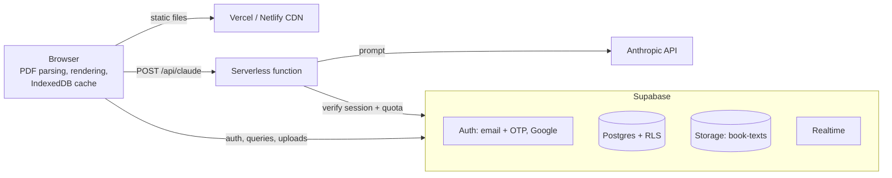

# Inkworlds

Upload a book and read it inside its own living world: animated backgrounds matched to the story, era-appropriate fonts, letters and diary entries in handwriting, weather that follows each chapter, a generated soundscape, highlights, notes, reading stats, public sharing, reading communities and comments in the margins.

**Stack:** Vite + vanilla JavaScript (ES modules) · Supabase (Postgres, Auth, Storage, Realtime) · Vercel or Netlify (static hosting + one serverless function) · Anthropic API (optional AI features)

---

## Architecture



## Where your data lives

| Data | Where | Who can read it |
|---|---|---|
| Site code (HTML, JS, CSS) | Vercel or Netlify CDN | Everyone |
| Accounts, sessions | Supabase Auth | Only Supabase |
| Book text | Supabase Storage, `book-texts/<user id>/<book id>.json.gz` (gzipped) | The owner, or everyone if the book is public |
| Book details, progress, highlights, bookmarks, stats, settings | Supabase Postgres | The owner only (public book details: everyone) |
| Communities, discussions, comments, likes | Supabase Postgres | Everyone (comments on a private book: only its owner) |
| Downloaded book text | Your browser's IndexedDB, as a cache | Only you, on that device |
| Original PDF files | **Never uploaded.** Parsed in the browser; only the extracted text is stored | — |
| Excerpts for AI features | Sent to the Anthropic API only when you press an AI button | — |

Access is enforced by Postgres **row-level security** and Storage policies (see `supabase/schema.sql`), not by the interface. Even with the public anon key, nobody can read another person's private books or write as someone else.

---

## Setup

### 1. Create the Supabase project
1. Create a project at [supabase.com](https://supabase.com). Pick the region closest to your readers (for India: **Mumbai, ap-south-1**).
2. Open **SQL Editor → New query**, paste all of `supabase/schema.sql`, and run it. It creates tables, indexes, security policies, triggers, the storage bucket, the two sample stories and two starter communities. It's safe to run again.
3. From **Project Settings → API**, copy the **Project URL** and the **anon / publishable key**.

### 2. Email sign-up with a one-time code
1. **Authentication → Sign In / Providers → Email:** keep it enabled and turn on **Confirm email**.
2. **Authentication → Emails → Templates:** Supabase sends links by default. Make these three templates send a code instead by including `{{ .Token }}`:
   - **Confirm signup**
     ```html
     <h2>Confirm your email</h2>
     <p>Your Inkworlds code is: <strong style="font-size:24px">{{ .Token }}</strong></p>
     <p>If you didn't create an account, ignore this email.</p>
     ```
   - **Magic Link** (used by "Email me a sign-in code"): same, with "Your sign-in code is".
   - **Reset Password**: same, with "Your password reset code is".
3. **Set up custom SMTP before real users arrive.** The built-in email sender is for testing only and is heavily rate-limited. Create a free account with a transactional email provider (Resend, Brevo, Amazon SES, Postmark…), verify your domain, and enter its SMTP details under **Authentication → Emails → SMTP Settings**.
4. Then raise the email limit under **Authentication → Rate Limits** (it starts low even with custom SMTP) to match your expected sign-ups per hour.

### 3. Google sign-in
1. In [Google Cloud Console](https://console.cloud.google.com): create a project → **APIs & Services → OAuth consent screen** (External, add your app name, support email and domain) → **Credentials → Create credentials → OAuth client ID → Web application**.
2. Under **Authorized redirect URIs**, add `https://<your-project-ref>.supabase.co/auth/v1/callback`.
3. Copy the client ID and secret into Supabase **Authentication → Sign In / Providers → Google** and enable it.
4. Google's branding guidelines ask for their official "Sign in with Google" button artwork; swap it into `viewSignIn` / `viewSignUp` in `src/auth.js` before launch.

### 4. Allowed URLs
**Authentication → URL Configuration:**
- **Site URL:** your production URL, e.g. `https://inkworlds.vercel.app`
- **Redirect URLs:** add `http://localhost:5173/**` for local development, plus your preview domains (e.g. `https://*-yourname.vercel.app/**`).

### 5. Run locally
```bash
cp .env.example .env      # fill in VITE_SUPABASE_URL and VITE_SUPABASE_ANON_KEY
npm install
npm run dev               # http://localhost:5173
```
The AI endpoint only runs under `vercel dev` or `netlify dev`. Everything else works with `npm run dev`.

### 6. Deploy
**Vercel:** import the GitHub repo. Vite is detected automatically. Add the environment variables below under **Settings → Environment Variables** and redeploy. `api/claude.js` becomes `/api/claude`.

**Netlify:** import the repo. `netlify.toml` sets the build command, output folder and functions folder. Add the same environment variables under **Site configuration → Environment variables**. `netlify/functions/claude.mjs` serves `/api/claude`.

| Variable | Where it's used | Required |
|---|---|---|
| `VITE_SUPABASE_URL` | Browser | Yes |
| `VITE_SUPABASE_ANON_KEY` | Browser | Yes |
| `VITE_AI_ENABLED` | Browser: shows the AI buttons | No (`false`) |
| `ANTHROPIC_API_KEY` | Server function only | For AI features |
| `CLAUDE_MODEL` | Server function | No (`claude-haiku-4-5-20251001`) |
| `AI_DAILY_LIMIT` | Server function: calls per user per day | No (`30`) |

Remember to add the production URL to Supabase's Site URL and Redirect URLs (step 4).

---

## Capacity and scaling (1,000+ users)

What does the work, and where the limits are:

- **Reading costs the server almost nothing.** PDF parsing, the animated worlds, sound, search and highlights all run in the reader's browser. Book text is downloaded once, gzipped, then cached in IndexedDB, so rereading is free.
- **Static hosting** on Vercel or Netlify is served from a global CDN and handles far more than 1,000 users.
- **The database** only holds small rows (book details, progress, comments). Every hot query is indexed, lists are paginated, and counts (likes, comments, members) are maintained by triggers instead of being counted on each request.
- **Realtime** connections are opened only while a book or discussion is on screen, one per reader.
- **Writes are batched:** reading time is sent every 30 seconds, progress 4 seconds after you stop scrolling, settings 1.5 seconds after a change.

Things to watch, in the order you're likely to hit them:

1. **Auth emails:** custom SMTP is required, and the hourly email limit must be raised for a launch day (setup step 2).
2. **Free-plan pausing:** Supabase pauses free projects after a week of low activity. For a portfolio site that goes quiet between interviews, this is the main risk. The Pro plan removes it.
3. **Egress and storage:** a typical novel is roughly 250–400 KB gzipped. Watch the Usage page in Supabase as the library grows.
4. **Realtime connection cap** on the free plan. If it's reached, comments still post and load; they just stop appearing live until someone reloads.

Before a big launch: check **Advisors** in the Supabase dashboard, and load-test with a tool like k6 against a staging project.

## Security model (summary)

- Private books and their text: readable only by the owner (`books`, `storage.objects` policies).
- Making a book public requires the owner to confirm they have the right to share it (enforced by a database constraint).
- Likes and comment counters can only be changed by triggers; users can't edit them directly.
- Only community members can start discussions; authors, book owners and community owners can delete comments.
- Personal data (progress, highlights, bookmarks, reading stats) is readable only by its owner.
- The Anthropic key stays on the server. Each AI call checks the user's session and a per-user daily quota in the database.

## Project structure

```
inkworlds/
├── index.html                  page shell and reader markup
├── src/
│   ├── main.js                 entry point: styles, start-up, auth, router
│   ├── app/                    app-wide logic
│   │   ├── router.js           #/paths → pages; opens and closes the reader
│   │   ├── books.js            load, save and add books
│   │   ├── sync.js             batched sync of progress, reading time, settings
│   │   └── helpers.js          shared UI helpers
│   ├── pages/                  one file per page
│   │   ├── home.js  library.js  book.js  discover.js
│   │   ├── communities.js  community.js  post.js
│   │   └── worlds.js  highlights.js  stats.js  settings.js  account.js
│   ├── reader/                 the reading experience
│   │   ├── reader.js           open/close, theme, sound, panels
│   │   ├── render.js           chapters, letters, diaries, telegrams, newspapers
│   │   ├── position.js         restoring your place, chapter tracking, progress
│   │   ├── highlight-paint.js  drawing saved highlights on the text
│   │   ├── annotations.js      selection, highlights, notes, bookmarks
│   │   ├── passage-comments.js comments on individual passages
│   │   ├── drawer.js           contents, bookmarks, highlights, search
│   │   ├── companion.js        AI world picker and spoiler-safe companion
│   │   └── controls.js         toolbar and settings panel
│   ├── components/             reusable UI pieces
│   │   ├── comment-thread.js  book-card.js  quote-card.js
│   ├── auth/
│   │   ├── session.js          who is signed in
│   │   └── views.js            sign in, sign up + code, Google, password reset
│   ├── services/               every Supabase call, one file per area
│   │   ├── supabase.js  client.js  session.js  profiles.js
│   │   ├── books.js  reading.js  communities.js  comments.js
│   │   ├── ai.js  account.js
│   │   └── index.js            re-exports everything as `cloud`
│   ├── engine/                 framework-free building blocks
│   │   ├── parser/             pdf.js  text.js  structure.js  detect.js
│   │   ├── scenes/             renderer.js  stage.js  draw-utils.js  index.js
│   │   │   └── worlds/         parchment  gothic  victorian  cosmos  ocean  forest  whimsical
│   │   └── ambience.js         generated soundscapes
│   ├── config/themes.js        the seven worlds: colours, fonts, handwriting
│   ├── content/samples.js      the two built-in sample stories
│   ├── lib/                    utils.js  cache.js
│   └── styles/                 index.css imports base, layout, pages/, reader, community, auth
├── server/claude-core.js       AI handler shared by both hosts
├── api/claude.js               Vercel function
├── netlify/functions/claude.mjs Netlify function
└── supabase/schema.sql         database, security policies, storage, seed data
```

**Dependency direction:** `pages/` and `reader/` use `app/`, `components/`, `services/` and `engine/`. `services/` only talks to Supabase. `engine/` has no knowledge of the UI or the database, so the parser and scenes can be tested on their own.

Run `npm run format` to keep the code style consistent (Prettier).

