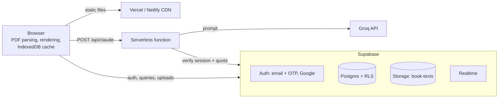

# Inkworlds

Upload a book and read it inside its own living world: animated backgrounds matched to the story, era-appropriate fonts, letters and diary entries in handwriting, weather that follows each chapter, a generated soundscape, highlights, notes, reading stats, public sharing, reading communities and comments in the margins.

**Stack:** Vite + vanilla JavaScript (ES modules) · Supabase (Postgres, Auth, Storage, Realtime) · Vercel or Netlify (static hosting + one serverless function) · Groq API (optional AI features)

---

## Architecture



## Where your data lives

| Data | Where | Who can read it |
|---|---|---|
| Site code (HTML, JS, CSS) | Vercel or Netlify CDN | Everyone |
| Accounts, sessions | Supabase Auth | Only Supabase |
| Book text | Supabase Storage, `book-texts/<user id>/<book id>.json.gz` (gzipped) | The owner, or everyone if the book is public |
| Book details, progress, highlights, bookmarks, stats, settings | Supabase Postgres | The owner only (public book details: everyone) |
| Communities, discussions, comments, likes | Supabase Postgres | Everyone (comments on a private book: only its owner) |
| Downloaded book text | Your browser's IndexedDB, as a cache | Only you, on that device |
| Original PDF files | **Never uploaded.** Parsed in the browser; only the extracted text is stored | — |
| Excerpts for AI features | Sent to the Groq API only when you press an AI button | — |

Access is enforced by Postgres **row-level security** and Storage policies (see `supabase/schema.sql`), not by the interface. Even with the public anon key, nobody can read another person's private books or write as someone else.

---

## Setup

### 1. Create the Supabase project
1. Create a project at [supabase.com](https://supabase.com). Pick the region closest to your readers (for India: **Mumbai, ap-south-1**).
2. Open **SQL Editor → New query**, paste all of `supabase/schema.sql`, and run it. It creates tables, indexes, security policies, triggers, the storage bucket, the two sample stories and two starter communities. It's safe to run again.
3. From **Project Settings → API**, copy the **Project URL** and the **anon / publishable key**.

### 2. Email sign-up with a one-time code
1. **Authentication → Sign In / Providers → Email:** keep it enabled and turn on **Confirm email**.
2. **Authentication → Emails → Templates:** Supabase sends links by default. Make these three templates send a code instead by including `{{ .Token }}`:
   - **Confirm signup**
     ```html
     <h2>Confirm your email</h2>
     <p>Your Inkworlds code is: <strong style="font-size:24px">{{ .Token }}</strong></p>
     <p>If you didn't create an account, ignore this email.</p>
     ```
   - **Magic Link** (used by "Email me a sign-in code"): same, with "Your sign-in code is".
   - **Reset Password**: same, with "Your password reset code is".
3. **Set up custom SMTP before real users arrive.** The built-in email sender is for testing only and is heavily rate-limited. Create a free account with a transactional email provider (Resend, Brevo, Amazon SES, Postmark…), verify your domain, and enter its SMTP details under **Authentication → Emails → SMTP Settings**.
4. Then raise the email limit under **Authentication → Rate Limits** (it starts low even with custom SMTP) to match your expected sign-ups per hour.

### 3. Google sign-in
1. In [Google Cloud Console](https://console.cloud.google.com): create a project → **APIs & Services → OAuth consent screen** (External, add your app name, support email and domain) → **Credentials → Create credentials → OAuth client ID → Web application**.
2. Under **Authorized redirect URIs**, add `https://<your-project-ref>.supabase.co/auth/v1/callback`.
3. Copy the client ID and secret into Supabase **Authentication → Sign In / Providers → Google** and enable it.
4. Google's branding guidelines ask for their official "Sign in with Google" button artwork; swap it into `viewSignIn` / `viewSignUp` in `src/auth.js` before launch.

### 4. Allowed URLs
**Authentication → URL Configuration:**
- **Site URL:** your production URL, e.g. `https://inkworlds.vercel.app`
- **Redirect URLs:** add `http://localhost:5173/**` for local development, plus your preview domains (e.g. `https://*-yourname.vercel.app/**`).

## Recent reader UX updates

The current reader update focuses on making Inkworlds feel like an immersive reading environment on phones and tablets without sacrificing the desktop experience.

### Mobile and tablet reading surface

- The reading page becomes a **floating book surface** on smaller screens instead of filling the entire viewport.
- The world remains visible around the reading page, preserving the animated environment on phones and tablets.
- Phone and tablet layouts have dedicated spacing, page widths, rounded corners and touch-friendly controls.
- Desktop layout remains the established desktop presentation rather than being replaced by the mobile layout.

### Reader navigation drawer

- The Contents / Bookmarks / Highlights / Search drawer has an explicit **Close (×)** control.
- On phones the drawer can use the full available width and its navigation controls have larger touch targets.
- The drawer can still be closed by tapping the scrim or pressing Escape.

### Universal page opacity control

**Reading Settings → Page opacity** is now a reader preference on every device.

- **Desktop default:** 100%, preserving the existing desktop appearance.
- **Phone/tablet default:** 50%, giving the immersive translucent look without requiring setup.
- The control ranges from **100% to 0%** and updates the reader immediately.
- The selected value is persisted with reader preferences.
- The opacity mapping is intentionally nonlinear so the immersive lower half of the slider has useful control.
- Lower opacity progressively reveals more of the world and increases the glass-like/translucent feeling.
- At **0%**, the reading surface is intended to disappear completely so the text floats directly over the world.

### Floating-text mode

The 0% state is deliberately different from simply making a parchment card transparent:

- no page background
- no page blur
- no page shadow
- no page border
- the world remains fully exposed
- text receives a subtle readability treatment so it can remain visible over maps, illustrations and animated backgrounds
- handwritten mode receives additional readability support because its strokes are thinner and more open

The current floating-text readability treatment is functional but still considered a **visual polish area**. The goal is a natural atmospheric separation rather than a heavy text outline.

### Reader settings and interaction

- Text size, sound volume, handwritten mode, background animation and page opacity remain in the same Reading Settings surface.
- Changing opacity updates the value shown beside the slider immediately.
- Legacy opacity values from earlier builds are handled so an old 72% default does not unexpectedly override the new device defaults.

### Current visual direction

The translucent reader takes inspiration from the principles of modern "liquid glass" interfaces — translucency, depth, background diffusion and subtle separation — while retaining Inkworlds' parchment/book identity rather than copying a generic glass UI.

### Current status

The mobile/tablet immersive reader and universal opacity system are working. The **0% floating-text mode is readable but still intentionally marked for future visual refinement**, especially for handwritten text over very busy backgrounds.

---

### 5. Run locally
```bash
cp .env.example .env      # fill in VITE_SUPABASE_URL and VITE_SUPABASE_ANON_KEY
npm install
npm run dev               # http://localhost:5173
```
The AI endpoint only runs under `vercel dev` or `netlify dev`. Everything else works with `npm run dev`.

### 6. Deploy
**Vercel:** import the GitHub repo. Vite is detected automatically. Add the environment variables below under **Settings → Environment Variables** and redeploy. `api/claude.js` becomes `/api/claude`.

**Netlify:** import the repo. `netlify.toml` sets the build command, output folder and functions folder. Add the same environment variables under **Site configuration → Environment variables**. `netlify/functions/claude.mjs` serves `/api/claude`.

| Variable | Where it's used | Required |
|---|---|---|
| `VITE_SUPABASE_URL` | Browser | Yes |
| `VITE_SUPABASE_ANON_KEY` | Browser | Yes |
| `VITE_AI_ENABLED` | Browser: shows the AI buttons | No (`false`) |
| `GROQ_API_KEY` | Server function only | For AI features |
| `GROQ_MODEL` | Server function | No (`openai/gpt-oss-20b`) |
| `AI_DAILY_LIMIT` | Server function: calls per user per day | No (`30`) |

Remember to add the production URL to Supabase's Site URL and Redirect URLs (step 4).

---

## Capacity and scaling (1,000+ users)

What does the work, and where the limits are:

- **Reading costs the server almost nothing.** PDF parsing, the animated worlds, sound, search and highlights all run in the reader's browser. Book text is downloaded once, gzipped, then cached in IndexedDB, so rereading is free.
- **Static hosting** on Vercel or Netlify is served from a global CDN and handles far more than 1,000 users.
- **The database** only holds small rows (book details, progress, comments). Every hot query is indexed, lists are paginated, and counts (likes, comments, members) are maintained by triggers instead of being counted on each request.
- **Realtime** connections are opened only while a book or discussion is on screen, one per reader.
- **Writes are batched:** reading time is sent every 30 seconds, progress 4 seconds after you stop scrolling, settings 1.5 seconds after a change.

Things to watch, in the order you're likely to hit them:

1. **Auth emails:** custom SMTP is required, and the hourly email limit must be raised for a launch day (setup step 2).
2. **Free-plan pausing:** Supabase pauses free projects after a week of low activity. For a portfolio site that goes quiet between interviews, this is the main risk. The Pro plan removes it.
3. **Egress and storage:** a typical novel is roughly 250–400 KB gzipped. Watch the Usage page in Supabase as the library grows.
4. **Realtime connection cap** on the free plan. If it's reached, comments still post and load; they just stop appearing live until someone reloads.

Before a big launch: check **Advisors** in the Supabase dashboard, and load-test with a tool like k6 against a staging project.

## Security model (summary)

- Private books and their text: readable only by the owner (`books`, `storage.objects` policies).
- Making a book public requires the owner to confirm they have the right to share it (enforced by a database constraint).
- Likes and comment counters can only be changed by triggers; users can't edit them directly.
- Only community members can start discussions; authors, book owners and community owners can delete comments.
- Personal data (progress, highlights, bookmarks, reading stats) is readable only by its owner.
- The Groq key stays on the server. Each AI call checks the user's session and a per-user daily quota in the database.

## Recent implementation files

The reader work is intentionally concentrated in a small set of files:

- `index.html` — reader settings controls and the mobile drawer close control.
- `src/reader/reader.js` — applies reader preferences, including device-aware defaults and the nonlinear opacity mapping.
- `src/reader/controls.js` — wires the opacity slider and reader controls to persisted preferences.
- `src/styles/reader.css` — responsive reader layout, mobile/tablet floating page treatment, opacity surface, drawer responsiveness and 0% floating-text styling.

This keeps the mobile-reader work isolated and makes it easy to review or roll back.

## Current reader update — October 2026

The current stable reader work focuses on immersive mobile/tablet reading while preserving the existing desktop experience. The opacity system is now a universal reader preference, not a mobile-only feature.

### Device defaults

| Device | Default page opacity | Behavior |
|---|---:|---|
| Desktop/laptop | 100% | Preserves the established desktop reading page |
| Phone | 50% | Translucent immersive reading surface |
| Tablet | 50% | Translucent immersive reading surface |

Users can override the default on any device.

### Page opacity behavior

- Reading Settings contains a **Page opacity** slider available on desktop, tablet and phone.
- The selected value updates immediately and is persisted with reader preferences.
- The mapping is intentionally nonlinear so the lower half of the slider gives useful immersive control rather than behaving like a simple alpha multiplier.
- 100% keeps the normal reading surface.
- Around 50% is the intended mobile/tablet sweet spot: the world is visible through a translucent, parchment-inspired surface.
- Lower values progressively expose more of the world and reduce the visual weight of the reading surface.
- 0% is a dedicated floating-text mode rather than simply a transparent page.

### 0% floating-text mode

At 0% the reading surface itself is removed:

- no page background
- no page blur/backdrop blur
- no page border
- no page shadow
- the animated world remains fully visible
- text receives a readability treatment so it remains visible over maps and illustrations
- handwritten mode receives additional contrast support because its strokes are thinner

The 0% readability treatment is currently functional and readable, but it remains an intentional **visual polish area**. The target is a natural atmospheric separation rather than a heavy outline or glow.

### Mobile/tablet navigation

- The reader uses a floating page surface on smaller screens so the animated world remains visible around the page.
- The navigation drawer has an explicit **× close button** as well as scrim/Escape closing.
- Touch targets are sized for phone/tablet use.
- Safe-area insets are respected on modern mobile devices.
- The desktop reader layout is not replaced by the mobile treatment.

### Liquid-glass-inspired visual direction

The translucent reader takes inspiration from the principles behind modern liquid-glass interfaces — translucency, depth, background diffusion and subtle separation — but keeps Inkworlds' own parchment/book identity. It should feel like **translucent magical parchment**, not a generic Apple-style card.

### Known status

- Mobile/tablet immersive surface: **working**
- Universal opacity control: **working**
- 50% phone/tablet default: **working**
- 0% true floating-text mode: **working**
- 0% readability, especially handwritten text over busy backgrounds: **working but still open for future visual refinement**

### Recent PDF cover and Discover fixes

- PDF uploads can extract a strong visual cover candidate instead of always falling back to a generated theme cover.
- Real PDF covers are stored in the `book-covers` Supabase Storage bucket and surfaced through `coverUrl`.
- Discover/community book cards use the real uploaded cover when one exists, with the generated theme cover remaining as the fallback.
- Long-book mood timelines were fixed with CSS so chapter segments stay inside the available width while preserving their word-count proportions.

### AI implementation

AI requests keep the existing application names and route structure for compatibility:

- Client helper: `askClaude()` in `src/services/ai.js`
- API route: `/api/claude`
- Server core: `server/claude-core.js`
- Netlify function: `netlify/functions/claude.mjs`
- Provider: **Groq**
- Default model: `openai/gpt-oss-20b`
- Default per-user daily limit: `30`

The naming is intentionally retained so the rest of the application does not need to know that the provider changed from the original Claude implementation.

## Recommended Git workflow for this update

After replacing the changed files and testing locally:

```bash
git status
git add .
git commit -m "Improve immersive reader and universal page opacity"
git push origin main
```

If you want an extra safety point before pushing:

```bash
git branch backup-before-reader-opacity
git push origin backup-before-reader-opacity
```

Do not commit `.env` or any API keys. The repository should contain `.env.example`, not production secrets.

## Project structure

```
inkworlds/
├── index.html                  page shell and reader markup
├── src/
│   ├── main.js                 entry point: styles, start-up, auth, router
│   ├── app/                    app-wide logic
│   │   ├── router.js           #/paths → pages; opens and closes the reader
│   │   ├── books.js            load, save and add books
│   │   ├── sync.js             batched sync of progress, reading time, settings
│   │   └── helpers.js          shared UI helpers
│   ├── pages/                  one file per page
│   │   ├── home.js  library.js  book.js  discover.js
│   │   ├── communities.js  community.js  post.js
│   │   └── worlds.js  highlights.js  stats.js  settings.js  account.js
│   ├── reader/                 the reading experience
│   │   ├── reader.js           open/close, theme, sound, panels
│   │   ├── render.js           chapters, letters, diaries, telegrams, newspapers
│   │   ├── position.js         restoring your place, chapter tracking, progress
│   │   ├── highlight-paint.js  drawing saved highlights on the text
│   │   ├── annotations.js      selection, highlights, notes, bookmarks
│   │   ├── passage-comments.js comments on individual passages
│   │   ├── drawer.js           contents, bookmarks, highlights, search
│   │   ├── companion.js        AI world picker and spoiler-safe companion
│   │   └── controls.js         toolbar and settings panel
│   ├── components/             reusable UI pieces
│   │   ├── comment-thread.js  book-card.js  quote-card.js
│   ├── auth/
│   │   ├── session.js          who is signed in
│   │   └── views.js            sign in, sign up + code, Google, password reset
│   ├── services/               every Supabase call, one file per area
│   │   ├── supabase.js  client.js  session.js  profiles.js
│   │   ├── books.js  reading.js  communities.js  comments.js
│   │   ├── ai.js  account.js
│   │   └── index.js            re-exports everything as `cloud`
│   ├── engine/                 framework-free building blocks
│   │   ├── parser/             pdf.js  text.js  structure.js  detect.js
│   │   ├── scenes/             renderer.js  stage.js  draw-utils.js  index.js
│   │   │   └── worlds/         parchment  gothic  victorian  cosmos  ocean  forest  whimsical
│   │   └── ambience.js         generated soundscapes
│   ├── config/themes.js        the seven worlds: colours, fonts, handwriting
│   ├── content/samples.js      the two built-in sample stories
│   ├── lib/                    utils.js  cache.js
│   └── styles/                 index.css imports base, layout, pages/, reader, community, auth
├── server/claude-core.js       AI handler shared by both hosts
├── api/claude.js               Vercel function
├── netlify/functions/claude.mjs Netlify function
└── supabase/schema.sql         database, security policies, storage, seed data
```

**Dependency direction:** `pages/` and `reader/` use `app/`, `components/`, `services/` and `engine/`. `services/` only talks to Supabase. `engine/` has no knowledge of the UI or the database, so the parser and scenes can be tested on their own.

Run `npm run format` to keep the code style consistent (Prettier).

